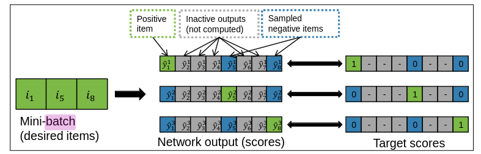

# Data
OTTO Data is a collection of sessions. A session is a sequence of interaction from an user. An unit of interaction is called an event.

An event comprised of timestamp, action and the interacted item ID. The timestamp is an unix time. Actions are divided into 3 types: "clicks", "adds to cart" and "orders". Item ID is a random interger represent an unique item in the seller's inventory.

# Negative Sampling

The number of unique items in recommendation system is often large that it is unfeasible to train the model to predict next item on the total inventory. It is more practical to train the model to distinguish between positive and negative samples. 

Negative samples are often considered items that user hasn't interacted in a session. However, some sampling methods generate negative samples from the whole inventory.
## Uniform sampling

Uniform sampling samples negative item ID as a vector random integers from the discrete uniform distribution from the dictionary. Uniformly sampled negative vectors ensure the model's overall accuracy in indefinite run.

## Mini-batch sampling

GRU4Rec model introduced mini-batch based sampling. For each example in the mini-batch, the other examples of the same mini-batch serve as negative examples.

Mini-batch sampling is a form of popularity-based sampling, since the training iterates through all events, thus the probability of an item acting as a negative sample is proportional to its support. Mini-batch sampling helps the algorithm learn to (generally) rank target items above popular ones.

## Top-K negative sampling

Top-K sampling is a method mentioned in []. The idea is to use a combination of uniform sampling and mini-batch sampling to train the model. The model subsequently focuses on updating the top-k negatives instead of updating the whole set of negative ratings.z
# Model

## SASrec

